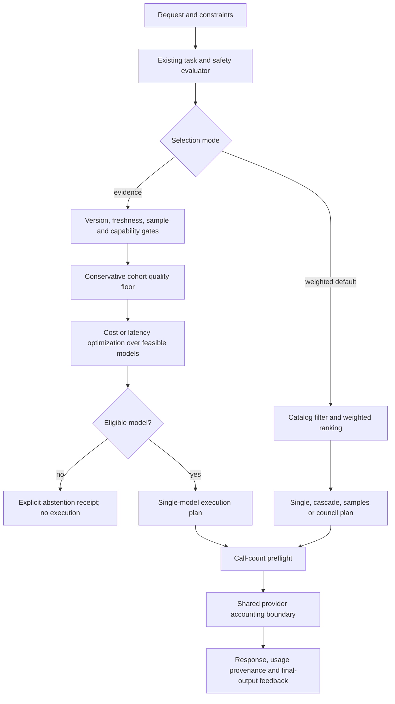

# Router redesign and research decisions

Implemented locally on 3 October 2026 in the existing `manufaujdar/ai-routing-gateway`
repository. The company working name remains EquiRoute. This is a tested alpha
implementation, not evidence of achieved customer savings or a production service.

## Repository decision and review scope

Remote `main` was verified at `c9b1a9eddff72e37e0e733ac1d1982475dd0eaf9`;
local starting HEAD was `55edcef5506b6e5fae55b376c5924a7b38aea1eb`. Their Python
routing runtime was identical. History differs in documentation and UI changes;
no reset, merge, push, new GitHub repository, or external deployment was needed.
The existing evaluation/selection/execution boundaries support these extensions.

Review covered the routing runtime, its relevant tests, API contract, and changed
documentation. The independent portable team SDK, frontend visual quality,
concurrent Spec Kit installation, and unrelated projects are outside this review.
`company/review-coverage.json` records file hashes and explicit scope exclusions.
This implementing session's review is not independent release certification.

## Problems repaired

| Finding | Resulting behavior | Implementation |
| --- | --- | --- |
| Catalog estimates were reported as actual spend; missing values became zero | Separate estimates, provider-reported amounts, known subtotal and unpriced call count; incomplete total is `null` | `telemetry.py`, `invocation.py` |
| HTTP success and response length were treated as quality | Form score, technical success, explicit task score and final-output feedback remain distinct | `execution.py`, `optimization.py` |
| Provider failure aborted a cascade | Bounded sequence continues; failures count in usage; all-failed execution raises and retains telemetry | `execution.py` |
| Library cascade calls had different request IDs; adapter model names overrode deployment IDs | One execution ID, catalog-owned deployment identity; runtime endpoint/model namespace | `execution.py`, `runtime.py` |
| Council calls bypassed telemetry | Every configured council answer, review, synthesis and failed attempt uses the shared invocation boundary | `council_handler.py`, `invocation.py` |
| A single surviving sample could be called a majority; parallel duration was summed as wall time | Majority uses requested sample count; failed samples remain visible; wall time and summed provider duration are separate | `execution.py` |
| Feedback could grow without bound or credit intermediate answers | Known retained request required; last-write update; feedback pruned with observations and attributed to the returned stage | `telemetry.py` |
| Infinities, NaN and some booleans passed numeric policy checks | Finite numeric and integer validation; API validation errors omit raw inputs | `models.py`, `api.py`, `selector.py` |
| SDK retries obscured the number of provider attempts | Bundled OpenAI-compatible adapter uses `max_retries=0`; router preflights `max_model_calls` | `adapters.py`, `router.py` |
| The plan claimed a hard spending guarantee | `hard_budget_respected=false` plus explicit estimate semantics | `models.py` |

Adaptive ranking is now disabled by default. `build_container(enable_adaptive_ranking=True)`
is an explicit operator choice for the existing heuristic advisor. It requires enough
quality labels per deployment/task; proposals additionally require complete cost data.
This is neither a trained contextual bandit nor a calibration procedure.

## Decision layer



Use `GatewayRequest(selection_mode="evidence", min_quality=0.9, ...)` with
server-configured `EvidencePolicy` and `ModelProfile.model_version`. Request
`context` cannot install calibration evidence. No evidence is bundled for real
models: the default catalog is a fixture, so evidence mode abstains until an
operator supplies suitable records.

Each `QualityEvidence` identifies a deployment, task, exact model/prompt-system
version, dataset version, binary successes/sample count, and evaluation timestamp.
The policy has a minimum sample count, freshness window, and fixed family-wide
error level. Its receipt lists each candidate's rejection and bound and hashes
the policy/evidence snapshot. An operator should include prompt, rubric and model
snapshot changes in `model_version`, not reuse an alias across changed behavior.

For a fixed family of K records, n independent held-out binary outcomes and
success rate p, the implemented lower bound is:

`max(0, p - sqrt(log(K / delta) / (2*n)))`

This is a one-sided Hoeffding bound with a union bound over the fixed record
family. It concerns the mean for the evaluated task cohort. Representative,
independent samples, a frozen evaluation design, correct labels and stable
behavior are assumptions, not conditions the code can prove. It does not
certify an individual answer, an adaptively selected subset, continuous repeated
recalibration, or a shifted production distribution. There is no conformal,
Clopper–Pearson, RL, or posterior-inference implementation claim.

After the floor passes, `balanced` and `cost` select the cheapest estimated
candidate, breaking ties by latency then quality; `latency` prioritizes latency;
`quality` prioritizes the lower bound. Hard capability and allow-list filters
apply first. A requested latency limit uses the catalog's p95 estimate and rejects
missing p95 values. Costs and p95 values remain operator-maintained estimates.

Evidence mode permits single-model execution only. Auto becomes single; an
explicit cascade/council/sampling request is rejected. Tool execution is not
certified by model quality records. Calibrating a model does not calibrate a
multi-call workflow, its output-conditioned stopping rule, or its tool effects.

## Run the implementation

After installing the local checkout:

```bash
PYTHONPATH=src python examples/evidence_routing.py
```

This offline, clearly labeled synthetic example creates a versioned policy,
prints an inspectable selection receipt, and compares it with weighted selection.
For real use, inject your catalog and evidence into `build_container`, and pass
that container to `ai_gateway.api.create_app`. API fields include `selection_mode`,
`required_capabilities` and `max_model_calls`. HTTP 200 with
`metadata.abstained=true`, `model=null` and a receipt means no provider was called.

`replay.replay_policies` compares identical held-out cases using recorded binary
outcomes, costs and durations for every eligible model. It rejects calibration/test
ID overlap, duplicate evaluation IDs, and missing counterfactual outcomes. It
reports answered coverage, conditional accuracy, correct answers per input,
actual replay cost, cost per correct answer and p95 duration. It evaluates
single-model selection only, not the task classifier or workflow execution.
Semantic duplicates, biased labels, model version provenance and independent
sampling still need dataset review. Synthetic output is not a savings benchmark.

## Additional research and engineering decisions

These extend the earlier [research inventory](company/EVIDENCE.md) and
[pinned repository review](company/REPOSITORY_REVIEW.md). No external implementation
was copied and no paper's results were reproduced in this session.

| Primary source and review depth | What it changes here | What is deferred |
| --- | --- | --- |
| [Conformal LLM Routing with Distribution-Free Safety Guarantees, ACL SRW 2026](https://aclanthology.org/2026.acl-srw.70/), paper method §3 reviewed | Calibration and explicit refusal are preferable to treating a heuristic score as accuracy. Its safety label measures relative harm versus the expensive model: both models being wrong still counts as safe routing. Our task-success label therefore remains separate. | Embedding gate and Clopper–Pearson threshold calibration require paired labels and careful selection calibration; not implemented. |
| [WISERouter, July 2026](https://arxiv.org/html/2607.23765v1), §4 algorithms reviewed | Workload allocation differs from per-request constraints. WR-Offline debits estimated mean costs under an expected-cost constraint. The implementation now explicitly distinguishes estimates from reported charges. | Contextual-bandit workload allocation and LP optimization require a workload horizon and data. Neither offers an atomic billing guarantee on its own. |
| [LENS, UAI 2026](https://proceedings.mlr.press/v337/liu26b.html), publisher abstract reviewed | Interaction feedback has unequal precision. Form scores, transport reliability and task outcomes are no longer interchangeable, and sparse evidence cannot drive recommendations. | Latent precision inference and its variational training are not implemented or evaluated here. |
| [RLCascadeRouter, August 2026](https://arxiv.org/html/2608.15817v1), introduction/design reviewed | Better quality prediction does not automatically imply better stop/select decisions. Replay reports downstream coverage, correct outcomes and expenditure. Cascades retain explicit stopping/return status. | Learned complementary-model selection and STOP policy require trajectories and comparison against simple baselines; no online exploration enabled. |
| [Hoeffding, 1963](https://www.tandfonline.com/doi/abs/10.1080/01621459.1963.10500830), original inequality used | Dependency-free, conservative fixed-cohort bound is a transparent first implementation. Multiplicity uses all records rather than only candidates left after filtering. | This simpler gate must not be advertised as the conformal paper's query-dependent risk control. |

Developer decisions remain grounded in the local GitHub runtime and the earlier
RouteLLM/LiteLLM/vLLM Semantic Router repository review. We retain a small offline
core and adapter boundary; do not duplicate a provider gateway or import a large
training runtime just to add selection. The bundled SDK's retry control is set
explicitly; caller implementations must document their own retry behavior.

## Remaining release and product gates

The subsequent [runtime-controls implementation](RUNTIME_CONTROLS.md) adds durable
single-host admission accounting, shared execution deadlines, output caps, a
process-local breaker and optional tenant API access. The original validation
record below describes the first redesign pass; the current completion record is
in `.ai/HANDOFF.md` at the repository root.

1. Obtain a consented, representative task dataset with independent calibration
   and evaluation splits, exact provider snapshots and task-specific labels.
   Compare against cheapest, strongest, static weighted and evidence policies.
   Report uncertainty and tail behavior; no universal optimum is established.
2. Validate operator charge ceilings and invoice reconciliation before selling
   a hard spending limit. SQLite reservations and token caps are now implemented;
   `max_cost_usd` adds a runtime admission cap only with a configured ledger.
   Billing after timeout may be unknown; `null` must not be treated as free.
3. Add cancelable end-to-end deadlines, queue/load observations and measured
   provider contracts before promising latency SLOs. A shared synchronous execution
   deadline and process-local breaker are now implemented. Present call
   limits count built-in gateway invocations; custom tools or hidden custom-adapter
   retries are outside that boundary.
4. Retain council/sampling as explicit experimental methods. Agreement and the
   default form verifier are not correctness checks. A returned rejected cascade
   answer has `accepted_model=null`; consumers must inspect verification status.
5. Treat this API and feedback store as alpha components. Optional bearer tenant
   access is implemented; hosted identity lifecycle, per-user authorization,
   durable telemetry, billing integration and
   independent release review remain prerequisites for a commercial service.

All 12 company agent role contracts remain in the existing registry. They are
bounded operating roles, not newly deployed autonomous services. No extra agent
framework, repository, paid call, public release or background process was created.

## Validation record

- 198 tests passed on Python 3.11.16 and 3.14.7, including the complete existing
  suite, new routing regressions, evidence refusal cases, replay checks and the
  executable synthetic example. Python 3.12/3.13 and other OSes were not run here.
- Nine initial regressions failed before repair and passed afterward. Council
  usage and paid-empty-response regressions likewise reproduced their defects.
- `ruff check .`, `git diff --check` and the 12-role team validator passed.
- The local deterministic readiness audit returned no findings; it is a static
  checklist, not production or independent certification.
- Source distribution and wheel build and Twine metadata checks passed. The core
  retains zero mandatory dependencies. No paid/provider inference was exercised.
- Existing API/asset tests passed; no visual browser or deployed-service test is claimed.

The scope ledger is a file-review record, not code/test coverage measurement.
All metrics in the runnable example are synthetic. These checks establish code
behavior and packaging, not achieved model accuracy or commercial savings.
