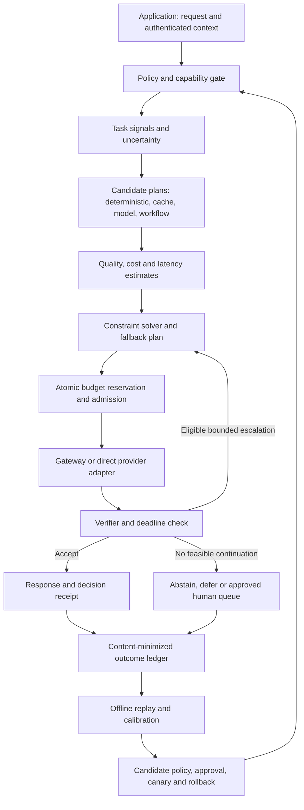

# Decision and routing architecture

Status: proposed design. Existing implementation is mapped in
[Repository review](REPOSITORY_REVIEW.md). This document does not change today's
GatewayRequest, selector weights, or dispatch semantics.

## Objective and meaning of accuracy

Define quality for each workload before optimizing it: exact field correctness,
task resolution, tested code behavior, or a human rubric. Record schema validity,
factual correctness, business success, and user satisfaction separately. Neither
HTTP success nor a confident answer is an accuracy label.

For request/context x, enumerate a small set of action plans a. An action contains
model version, deployment, prompt version, reasoning effort, output cap, verifier
and bounded fallback policy. Tools/cache/deterministic paths are candidates only
when they satisfy the same task and authorization contract.

```text
minimize expected total cost(a | x)
subject to:
  lower supported quality estimate(a | x) >= customer quality floor
  P(total completion latency(a | x) <= deadline) >= 1 - allowed miss rate
  maximum reservable exposure(a) <= remaining workflow and tenant budgets
  all capability, data, tool, region and authorization constraints hold
```

This is a proposed constrained optimization problem, not a universal optimality
claim. Quality bounds are supported for evaluated cohorts; per-query predictions
need calibration and out-of-distribution detection. They cannot guarantee an
individual answer is true. Unknown quality excludes a candidate from automatic
quality-sensitive routing; use a customer-approved static route or abstain.

Prune dominated options only under comparable measurements; with uncertainty,
do not confidently eliminate overlapping candidates. Tie-break using lower
deadline-miss risk, then stable action ID. An optional soft-utility mode uses
explicit fixed reference scales, not min/max normalization over a changing pool.
Adding an irrelevant model must not silently change every route's score.

Presets are customer contracts, not fixed magic weights:

| Preset | Optimize | Constraints |
| --- | --- | --- |
| Economy | Total cost per request | Agreed task-quality floor, generous completion deadline |
| Interactive | Cost among deadline-feasible plans | Separate TTFT and completion targets, quality floor |
| Quality first | Measured task success | Spend cap, deadline, evidence floor; may abstain |
| Batch | Successful tasks per budget | Queue completion deadline and freshness; batch/cache eligible |

## Components and ownership



The data path is deterministic wherever possible. The control plane produces
versioned immutable policy bundles and evaluation evidence. A broken control
plane does not block existing signed local policies; expired or invalid policies
cause a bounded conservative fallback or rejection, never unrestricted routing.
Authentication and tenant policy are trusted server inputs. Prompt text cannot
alter allowlists, increase budgets, authorize tools, or pick a privileged tenant.

## Proposed contracts

| Contract | Required fields and invariants |
| --- | --- |
| RequestEnvelope | request/workflow/step IDs, authenticated tenant, task contract, policy version, deadline, input modality, tool/schema hashes, privacy class, output cap; raw content stays in the authorized execution boundary |
| ModelDeployment | provider, explicit model revision or alias-resolution timestamp, deployment/region, capabilities, prices with validity interval, rate limits and retention terms; distinct model and deployment IDs |
| OutcomeEstimate | candidate ID, task cohort, sample count, quality estimate and interval, calibration version, evidence age, predicted token distribution, TTFT/completion distributions, unsupported/OOD flag |
| DecisionReceipt | eligible and rejected IDs/reasons, estimate versions, selected plan, objective, reservations, fallback triggers, confidence limitations, policy/model/prompt IDs; avoid raw prompt excerpts in explanations |
| AttemptEvent | attempt ID, idempotency key, provider request ID, timestamps, tokens including cache/reasoning where available, amount/currency, estimated/known/pending cost status, error and verifier result |
| OutcomeEvent | request ID, outcome definition/version, score, source, label time, adjudication status and sampling propensity if explored; feedback is authenticated and deduplicated |

Amounts use integer micro-USD or decimals, never binary floating point for billing.
Unknown cost is `pending` with held reservation, not zero. Separate invoices from
estimates; preserve coverage for any savings comparison. Export tenant-scoped
aggregates. Prompts, responses and embeddings are not stored by default; embeddings
can contain sensitive information. Opt-in labeled corpora stay in customer storage
with retention, deletion, access control and provenance. No cross-tenant learning
without an explicit data agreement.

## Budget and latency enforcement

Reserve worst-case **bounded** billable exposure before dispatch: input, capped
output/reasoning, tools, verifier, retries, hedge, cache creation, and provider fees
covered by that plan. Atomic tenant and workflow counters prevent concurrent
workers independently spending the same balance. Commit actual cost and release
only confirmed unused exposure. A timed-out or cancelled request can still incur
cost; retain pending exposure and reconcile it. Crash recovery uses durable
reservation IDs, not a blind reservation timeout that makes money reusable.

This bounds application-authorized exposure only where adapters expose enforceable
caps and billing semantics. If provider charges cannot be bounded, reject a strict
cap request or require a separately agreed best-effort policy. Never promise
absolute invoice ceilings from statistical token estimates.

Track time to first visible token and time to a usable completed result separately.
Completion includes routing, queueing, inference, verification and retries.
Do not add p95 values and call the sum an end-to-end p95: replay joint paths, or
allocate per-stage violation probabilities with a documented union bound. On
deadline expiry, stop dispatch and cancel where supported. Return a clear terminal
status; cancellation is not proof the provider stopped billing.

Router-overhead target for the initial local rule path: p95 <=10 ms and <=5% of
the customer's completion budget on a specified load profile. This is an untested
engineering target. Learned predictors have separate measured budgets and are
bypassed when their overhead exceeds expected value.

## Backup methodologies: alternatives, not an always-on stack

All methods pass the same policy gate, reservation system, compatibility checks,
and workflow attempt cap. The example configuration disables experimental ones.

| Method | Use when | Cost/latency consequence and stop condition |
| --- | --- | --- |
| Static rules / approved model | Cold start, predictor outage, stale calibration | Minimal router overhead. Use only an eligible approved route; abstain if none. |
| Exact cache / deterministic code | Identical authorized request or formally defined transformation | Cheapest path where valid. Tenant, prompt, tool schema, source freshness and model/policy versions participate in cache identity; no cross-tenant hit. |
| Local embedding/classifier or small learned predictor | Stable labeled cohorts and replay advantage | Charge compute and lookups; reject OOD/low support. Revert to rules on drift. |
| Verified cascade | Cheap model often succeeds and verifier discriminates failures | Sequential latency and false-accept risk. At most one quality escalation initially; require positive expected incremental value and remaining time/exposure. |
| Provider failover | Transient availability failure | Same model/capability contract where possible. Bounded retry with jitter; alternate model re-enters quality/policy gates. |
| Retrieval/tool-assisted route | Missing evidence or deterministic external operation | Retrieval/tool charges and failure surface. Preserve source provenance and approval; tool authority never comes from the router. |
| Deadline hedge | Severe tail latency, parallel independent capacity, idempotent generation | Both calls may bill. Disabled initially; reserve both, select first acceptable result, never race side-effecting tools. |
| Diverse samples / ensemble / council | High-value task, demonstrated complementary errors and useful verifier | Pay all generation and judge costs; one bounded round and fixed fan-out. Agreement is not correctness. Disabled for normal traffic. |
| Conservative contextual bandit | Stable labels, approved low-risk exploration, sufficient traffic | Log action probabilities and delayed outcomes; cap exploration budget. No exploration in restricted/high-risk cohorts; rollback on guardrail breach. |
| Progress-aware workflow planner | Multi-step tasks with measured stage dependencies | Re-plan at stable step boundaries against remaining budget and state. Never switch providers mid-stream or silently reinterpret an outstanding tool call. |
| Defer / abstain / human review | No feasible route, conflicting checks, irreducible uncertainty | Explicit terminal/deferred result. Human queue has an owner, SLA and capped cost; sending a person a message needs authorization. |

Semantic caching, prompt compression, local distillation and hardware-aware
scheduling are later options. Each needs an ablation against the simpler path;
compression must preserve task meaning, and local-model cost includes hardware
utilization, idle capacity and operations, not just tokens.

## Request lifecycle and failure behavior

```text
RECEIVED -> AUTHORIZED -> PLANNED -> RESERVED -> DISPATCHED -> VERIFIED
VERIFIED -> ACCEPTED | REPLAN | ABSTAINED
DISPATCHED -> FAILED | CANCEL_REQUESTED | COST_PENDING
terminal execution + reconciled cost -> CLOSED
```

Keep execution state separate from financial reconciliation: an accepted answer
may still have a pending bill. The attempt count is global across adapters and
fallbacks. One layer owns retries; an adapter must report its internal attempts
or disable them. Explicitly classify rate limits, overload, schema mismatch,
context overflow, content refusal, timeout and verifier rejection. Do not retry a
policy refusal through another provider to evade it. Context overflow requires an
approved transformation, not silent truncation.

Count every provider generation or judge invocation against the global call cap.
With the illustrative two-call cap, a two-model cascade requires a deterministic
verifier; adding a model judge consumes a call and can eliminate the escalation.
Transport retries that reach a provider also consume the cap. Policy explicitly
defines any separately metered non-generation tools and reserves their exposure.

Once streaming bytes are visible, do not splice another model's output into them.
Buffer before verification where the application requires a verified answer;
otherwise label provisional streaming and expose a final verification status.
Tool actions require app-owned idempotency and commit semantics; ambiguous tool
completion cannot be safely retried solely because a model request timed out.

## Implementation seams and future compatibility

Keep `Evaluator`, `ModelSelector`, `ExecutionPlanner`, handlers and adapters.
Add versioned request/estimate contracts, a separate budget ledger and outcome
store behind interfaces. Introduce the new constrained selector as opt-in; do
not alter existing `balanced` weights in place. Preserve decision-only behavior
and mock defaults. A compatibility adapter translates old requests explicitly.

Start with a compact pool: fast generalist, strong generalist, one justified
specialist. Add candidates only for measured complementarity. Provider aliases,
prices, prompt templates and model revisions must invalidate stale calibration
selectively. Pin a session at tool/protocol boundaries; cache-aware stickiness
can be cheaper than independently re-routing every turn.

Modality-specific quality definitions and hardware/region-aware deployments fit
the same contracts. Avoid forcing image, voice, code and text into one scalar
benchmark. A future router may select reasoning effort or tool availability as
well as model ID; qualify each configuration as a distinct action. Policy export
and replay should remain usable if the customer replaces the underlying gateway.
